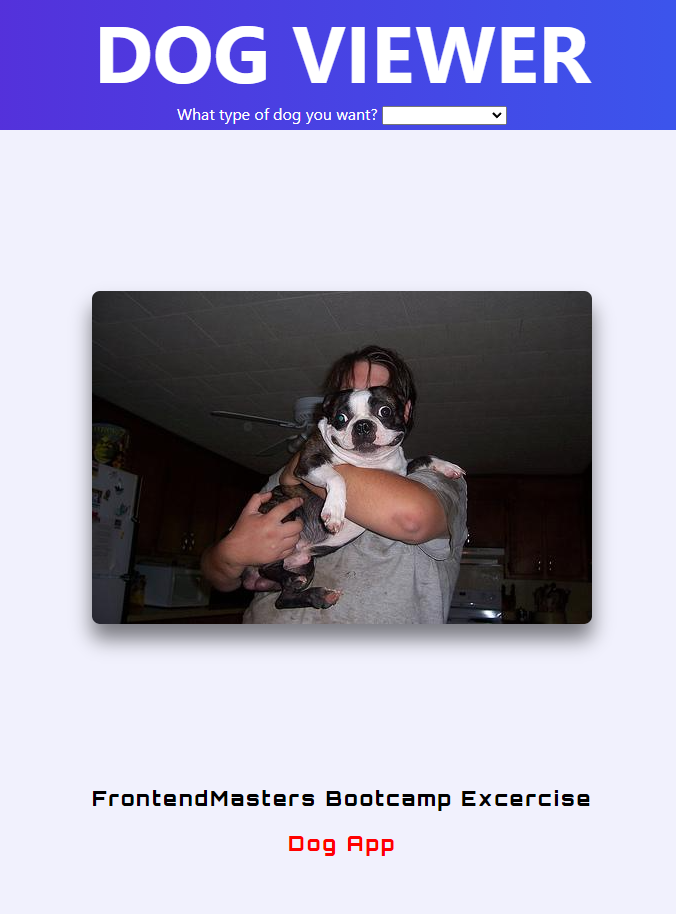

# 🐶DOG APP
👉**Demo:** [The Doggos](https://mitzelldone.github.io/Dog_App/index.html)

## Introduction
- This project is going to allow users to select a breed from a drop down list and then display a random picture of that breed.
- A dog picture viewer using the [dog.ceo API](https://dog.ceo/dog-api/documentation/).
## Javascript Guide
1. Show loading spinner
2. Make URL
3. Fetch form the API
4. Use the URL to change the current image
5. Stop showing loading spinner
## Credits
- Guides in building the Dog App: https://frontendmasters.github.io/bootcamp/dogs
- [Frontend Masters Bootcamp](https://frontendmasters.com/bootcamp/)
