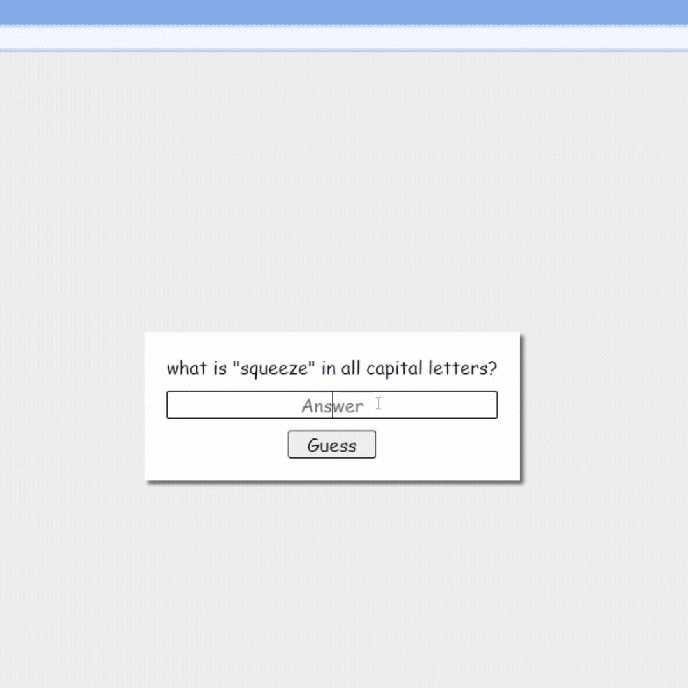

# ❓Quiz
## Demo
👉[Quiz](https://mitzelldone.github.io/Quiz/index.html)

## Description
Build simple quiz game for beginner.
1. **About the game:** 
 - Every correct answer you will get a point and the result will be shown after you finish it.
 - Pop-up will appear to let you know your answer is correct or incorrect.

2. **Want can be when building the game?**
 - Improve JavaScript Fundamentals.
   - .toUpperCase
   - .substring
   -  parseInt
   -  Math.max
  
## Credits
- Guides in building the Quiz: https://frontendmasters.github.io/bootcamp/quiz
- [Frontend Masters Bootcamp](https://frontendmasters.com/bootcamp/)

