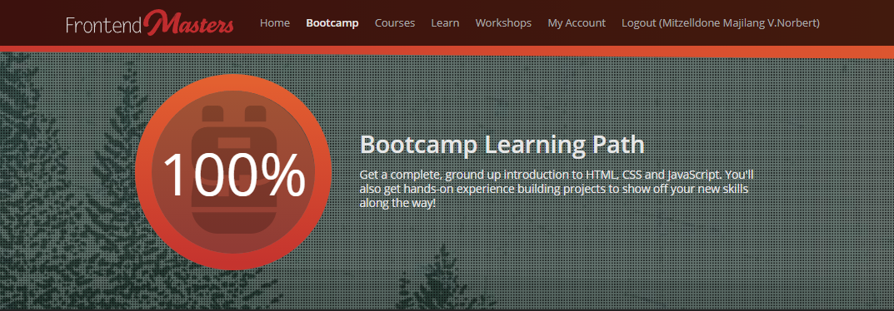

# Frontend Masters Bootcamp 🏕️ 

## Table Of Content
Here are some of the project

1. [👽🛸Alien Abduction Order Form](https://github.com/Mitzelldone/FrontendMasters-Bootcamp/tree/main/Alien%20Abduction%20Order%20Form)
2. [❓Quiz](https://github.com/Mitzelldone/FrontendMasters-Bootcamp/tree/main/Quiz)
3. [IOS_Calculator](https://github.com/Mitzelldone/FrontendMasters-Bootcamp/tree/main/IOS%20Calculator)
4. [🖼️Image Gallery](https://github.com/Mitzelldone/FrontendMasters-Bootcamp/tree/main/Image%20Gallery)
5. [🖼️Image Gallery Version 2](https://github.com/Mitzelldone/FrontendMasters-Bootcamp/tree/main/Image%20Gallery%20v2)
6. [🐶DOG APP](https://github.com/Mitzelldone/FrontendMasters-Bootcamp/tree/main/Dog%20App)
7. [🕹️ Feed A Star Mole Game](https://github.com/Mitzelldone/FrontendMasters-Bootcamp/tree/main/Feed%20A%20Star%20Mole)

## Credit
Instructor:
- [Brian Holt](https://github.com/btholt)
- [Jen Kramer](https://github.com/jen4web)

Website:
- [Frontend Masters Bootcamp](https://frontendmasters.com/bootcamp/)
- [Frontend Masters Bootcamp Guide](https://frontendmasters.github.io/bootcamp/)
